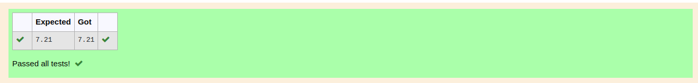

# DISTANCE-BETWEEN-TWO-POINTS

## AIM:
To write a python program to find the distance two 2 points
## ALGORITHM:
### Step 1: 
import the math module
### Step 2: 
enter the values in a list in two variables
### Step 3: 
Substitute the values in the distance formula  
### Step 4: 
store the answer of the substitution in variable
### Step 5: 
print the variable which stored answer
### PROGRAM:
  ```
  #Program to find the distance between two points.
#Developed by: HARISH RAGAVENDRA S
#RegisterNumber:22008967
import math as m
l1=[4,2]
l2=[10,6]
d=m.sqrt((l2[0]-l1[0])**2+(l2[1]-l1[1])**2)
print("{:.2f}".format(d))
  ```


### OUTPUT:

### RESULT:
